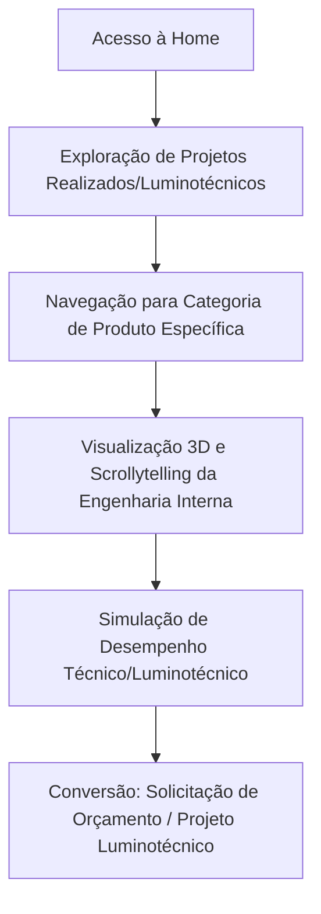

# Project Overview: Grupo 3G - Site Principal

## 1. Visão Geral
Este documento estabelece a base conceitual e estratégica do Site Principal do **Grupo 3G**. O sistema funciona como um catálogo interativo premium focado em demonstrar a superioridade tecnológica e engenharia dos produtos de iluminação pública e esportiva da empresa. 

O diferencial competitivo está na demonstração visual interativa através de renderizações 3D em tempo real baseadas em scroll (scrollytelling) com `[[domain-model#Entidade: Modelo 3D Interativo|Modelos 3D Interativos]]`.

> [!IMPORTANT]
> Todo o desenvolvimento e modificações de código devem seguir estritamente as diretrizes estabelecidas nas `[[golden-rules|Regras de Ouro (Golden Rules)]]`, principalmente a regra da não-intervenção em trechos funcionais não requisitados.

## 2. Objetivos de Negócio
- **Geração de Demanda Qualificada (MQL)**: Converter visitantes em prospects enviando leads de engenharia e compras diretamente para o canal de atendimento especializado via `[[domain-model#Bounded Context: Leads e CRM|CRM/WhatsApp]]`.
- **Posicionamento de Engenharia**: Mostrar que a 3G não apenas vende luminárias, mas desenvolve e entrega **projetos luminotécnicos** customizados que comprovam o retorno sobre investimento (ROI) e conformidade técnica.
- **Engajamento e Educação Visual**: Reduzir a barreira de compreensão técnica sobre as partes e a montagem das luminárias (Modular, Homologada, Solar e Ebron) por meio de interações com `[[domain-model#Agregado: Catálogo de Produtos|Catálogos 3D]]`.

## 3. O Golden Path (Caminho de Ouro)
O fluxo principal do usuário final dentro do site para maximizar a conversão é estruturado como:

1. **Entrada**: O usuário aterrissa na `[[PRD#RF001 - Home Page e Linhas de Produto|Página Inicial]]` e é impactado pela escala dos projetos luminotécnicos concluídos.
2. **Exploração**: Acessa uma página de produto (ex: `[[PRD#RF002 - Catálogo Interativo 3D (Scrollytelling)|Páginas de Detalhe com 3D]]`).
3. **Interação**: Utiliza o scroll da página para ver o produto explodir/montar em 3D usando `[[tech-stack#Three.js / React Three Fiber|Three.js]]`.
4. **Decisão**: Lê a ficha técnica e os resultados práticos obtidos em projetos luminotécnicos similares.
5. **Conversão**: Aciona o botão de orçamento, gerando um evento rastreado via `[[observability#Métricas de Negócio|Métricas de Conversão]]`.

## 4. Gargalos de Escabilidade Previsíveis
- **Desempenho no Carregamento Web (FCP/LCP)**: O carregamento de malhas 3D complexas (.GLTF/.GLB) e texturas 4K pode degradar drasticamente a performance em conexões móveis. Requer compressão rigorosa (Draco compression) e `[[decisions#ADR 002: Renderização de Modelos 3D com Next.js Server Components e Lazy Loading|Lazy Loading de assets 3D]]`.
- **Performance de Renderização**: WebGL rodando em dispositivos de baixo custo pode causar travamento (lag) de frames por segundo (FPS). O sistema de renderização do `[[tech-stack#Three.js / React Three Fiber|Three.js]]` deve implementar fallback para imagens 2D otimizadas e controle dinâmico de qualidade do canvas.
