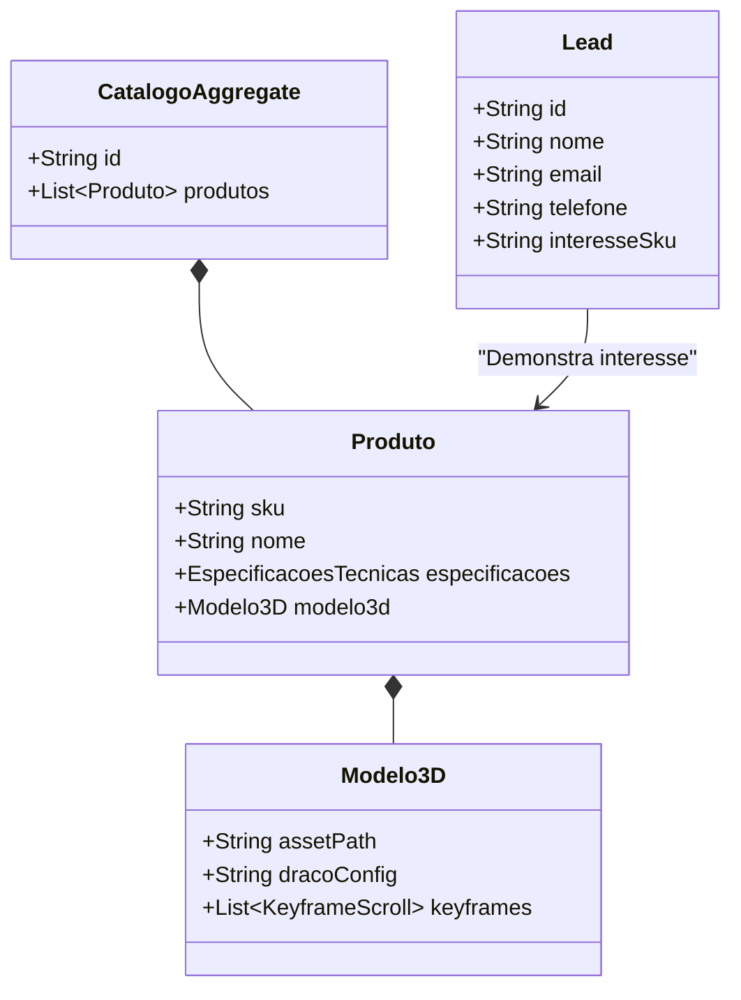

# Modelo de Domínio (DDD) — Site Grupo 3G

Este documento define os Bounded Contexts, Entidades, Agregados e Value Objects do sistema, fornecendo uma taxonomia ubíqua para desenvolvedores e agentes de IA.

---

## 1. Bounded Context: Catálogo de Produtos Interativos

Responsável pela gestão de dados de marketing, especificações técnicas de iluminação e controle dos assets tridimensionais das luminárias.

### Agregado: Catálogo
Responsável por garantir a consistência das informações das linhas de produtos exibidas ao cliente.
- **Entidade Raiz (Root Entity)**: `Produto`
  - **Identificador**: `SKU` (ex: `LUM-SOL-HELIOS-050`)
  - **Atributos**: Nome, Descrição Comercial, Linha (Solar, Homologada, Modular, Ebron).
  
- **Entidade Associada**: `Modelo 3D Interativo`
  - **Identificador**: `ModeloId`
  - **Atributos**: `assetPath` (URI do arquivo .glb/.gltf hospedado no CDN/servidor), `fileSize`, `dracoCompression` (Boolean).
  - **Comportamentos**:
    - `calcularInterpolacaoScroll(offsetScroll)`: Retorna as coordenadas de translação, rotação e escala da câmera e da malha 3D baseada no ponto de rolagem da página (`[[tasks#TASK-002: Desenvolvimento do Core de Scrollytelling 3D|TASK-002]]`).

- **Value Object**: `Especificações Técnicas`
  - **Atributos**:
    - `potenciaW` (Inteiro)
    - `fluxoLuminosoLumen` (Inteiro)
    - `vidaUtilHoras` (Inteiro)
    - `grauProtecaoIP` (String, ex: "IP66")
    - `certificacaoINMETRO` (Boolean)

---

## 2. Bounded Context: Leads e CRM

Responsável pela captura, qualificação e encaminhamento de prospects para o time de engenharia comercial.

### Agregado: Lead de Venda
Garante a integridade dos dados capturados dos formulários de contato antes de enviá-los para serviços de integração ou WhatsApp.
- **Entidade Raiz (Root Entity)**: `Lead`
  - **Identificador**: `LeadId` (UUID)
  - **Atributos**: Nome, E-mail, Telefone, Mensagem, `interesseSku` (referência ao `SKU` do `Produto`).
  - **Comportamentos**:
    - `qualificarLead()`: Analisa o preenchimento correto dos dados e determina se o e-mail ou domínio é corporativo (B2B).
    - `gerarMensagemWhatsApp()`: Formata um link de URL de redirecionamento contendo um template estruturado da demanda do produto de interesse para o comercial (`[[tasks#TASK-003: Implementação de Captura de Leads e Integração WhatsApp|TASK-003]]`).

- **Value Object**: `ContatoCliente`
  - **Campos**: E-mail (validado por regex), Telefone (validado com DDI e DDD nacional).
  - **Segurança**: Aplicar hashing de rastreabilidade ou pseudonimização nos logs para conformidade com a LGPD (`[[security-model#1. Proteção de Dados (LGPD)|Segurança - LGPD]]`).

---

## 3. Bounded Context: Projetos Luminotécnicos (Estudos de Caso)

Responsável por demonstrar a autoridade da empresa na modelagem luminotécnica de espaços públicos e esportivos.

### Agregado: Projeto Executado
- **Entidade Raiz**: `EstudoDeCaso`
  - **Identificador**: `CasoId`
  - **Atributos**: Nome da Cidade/Localidade, Estado, Imagens Antes/Depois, SKU das Luminárias Utilizadas, Redução de Consumo Energético calculada em porcentagem (`Value Object: EconomiaProjetada`).
  
- **Value Object**: `EconomiaProjetada`
  - **Campos**: `consumoAnteriorKWh`, `consumoAtualKWh`, `porcentagemReducao` (Calculada como: `(anterior - atual) / anterior * 100`).

---

## 4. Regras de Negócio e Invariantes
1. Um `Produto` só pode ser exibido se tiver pelo menos um `Especificações Técnicas` associado.
2. O `Modelo 3D Interativo` associado a um produto deve conter obrigatoriamente a malha correspondente ao modelo físico da luminária cadastrada (Invariante do Catálogo).
3. A captura de um `Lead` de orçamentos exige a confirmação explícita de concordância com as diretrizes de privacidade de dados (`[[security-model#1. Proteção de Dados (LGPD)|Termos de Privacidade LGPD]]`).
