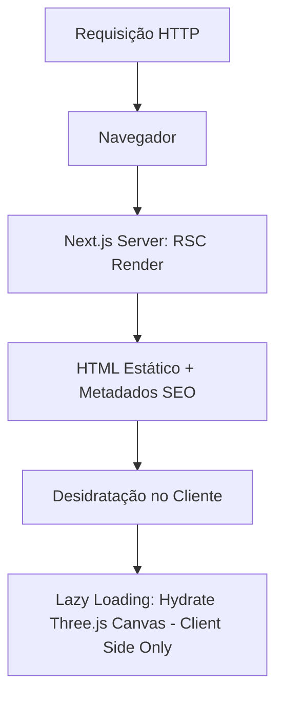

# Architecture Decision Records (ADRs)

Este documento centraliza as decisões arquiteturais tomadas para o projeto do Site Principal do Grupo 3G, detalhando o contexto, alternativas consideradas e implicações de cada escolha.

---

## ADR 001: Arquitetura Next.js App Router e Server Components

### Contexto
O site precisa de excelente desempenho em SEO (Search Engine Optimization) e carregamento inicial extremamente rápido para atrair e qualificar clientes corporativos. No entanto, as páginas internas exibem modelos 3D complexos que requerem manipulação no lado do cliente.

### Decisão
Adotamos o **Next.js 14/15 App Router** com foco em **React Server Components (RSC)** por padrão.

### Consequências
- **Positivas**:
  - SEO excelente: Toda a informação descritiva de produtos, cabeçalhos, títulos e dados estruturados (JSON-LD) é renderizada no servidor e entregue como HTML puro.
  - Redução drástica do First Contentful Paint (FCP) inicial.
- **Negativas**:
  - Aumenta a complexidade de desenvolvimento, pois exige a demarcação estrita de fronteiras de componentes cliente (`"use client"`) para os sub-componentes que renderizam as cenas 3D.

---

## ADR 002: Renderização de Modelos 3D com React Three Fiber (R3F) vs Vanilla WebGL

### Contexto
O site necessita de scrollytelling 3D interativo de alta fidelidade para demonstrar o design mecânico dos produtos (luminárias). A equipe de desenvolvimento precisa codificar essas interações de forma produtiva, testável e manutenível.

### Alternativas Consideradas
1. **Vanilla WebGL/Three.js**: Manipulação direta do DOM Canvas e loop de animação manual.
2. **React Three Fiber (R3F) + Drei**: Abstração declarativa em React que integra a cena ao ciclo de vida dos componentes.
3. **Spline Tool Web Components**: Renderização via iframe ou exportação directa de biblioteca de terceiros.

### Decisão
Decidimos por **React Three Fiber (R3F) + Drei** devido à sua modularidade e excelente integração com o ecossistema React.

### Consequências
- **Positivas**:
  - **Produtividade**: Permite declarar câmeras, luzes e malhas como tags React (`<ambientLight />`, `<mesh />`), simplificando a composição da cena.
  - **Scroll Integrado**: O uso de utilitários como `<ScrollControls>` do Drei permite amarrar a timeline de animações do modelo 3D ao scroll nativo de forma extremamente declarativa.
  - **Lazy Loading facilitado**: Componentes R3F podem ser importados dinamicamente via `next/dynamic` apenas quando entram na viewport (`[[PRD#Performance & Web Vitals (P0)|NFR - Lazy Loading]]`).
- **Negativas**:
  - Sobrecarga (overhead) no tamanho do bundle javascript (cerca de ~150KB gzip somando Three.js + R3F), exigindo uma rigorosa política de lazy loading para mitigar atrasos no LCP.

---

## ADR 003: Armazenamento e Compressão de Assets 3D (GLTF/GLB)

### Contexto
Cada arquivo 3D gerado pelo time de design em formato GLTF/GLB possui alta contagem de polígonos e materiais pesados, gerando arquivos de 10MB a 35MB. Isso viola os `[[PRD#Performance & Web Vitals (P0)|Requisitos Não Funcionais (NFRs)]]` de performance de carregamento (< 2MB).

### Decisão
Implementar um pipeline obrigatório de pré-processamento de modelos 3D usando compressão **Draco** e simplificação de malha via `gltf-pipeline` e `gltfjsx` antes de commitar no repositório.

### Consequências
- **Positivas**:
  - Redução de até 90% no peso do arquivo final.
  - Economia de banda de rede do servidor e carregamento quase instantâneo para o usuário.
- **Negativas**:
  - Exige que os desenvolvedores tenham ferramentas Node cli locais instaladas (`gltf-pipeline`) ou usem um script de conversão durante a esteira de build (`[[tasks#TASK-002: Desenvolvimento do Core de Scrollytelling 3D|TASK-002]]`).
  - Ligeira perda de detalhes microscópicos da luminária, que é imperceptível na visualização web standard.
